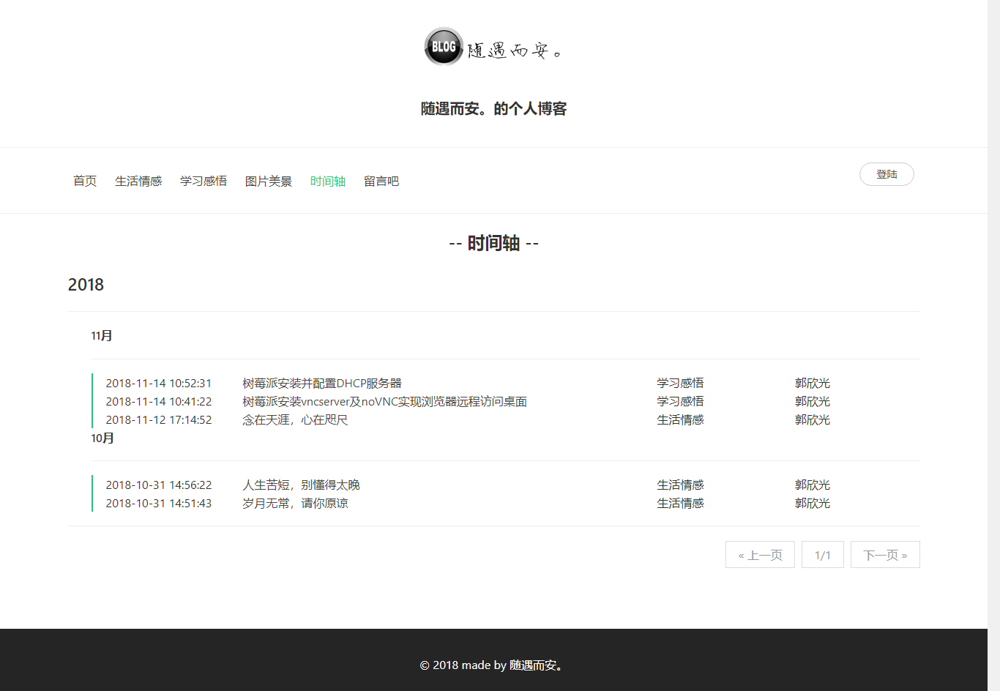

# myBlog

## 开发相关介绍

- 开发环境：jdk1.8.0_17 + MySQL5.5.28
- 开发工具：IntelliJ IDEA 2016.1.3
- 使用框架：spring boot + thymeleaf + Amaze UI

> 目录说明：
> - 'blog'目录为该项目源代码
> - '图片'目录为该项目效果截图，为README.md所使用的相关图片，与该项目无关
> - '数据库'目录为该项目所需数据库设计

## 项目截图

### 博客首页

### 文章列表

> 下面以生活情感页面作为代表展示，学习感悟页面与之相同

### 浏览文章

### 发表文章

### 图片美景

### 时间轴

### 留言

